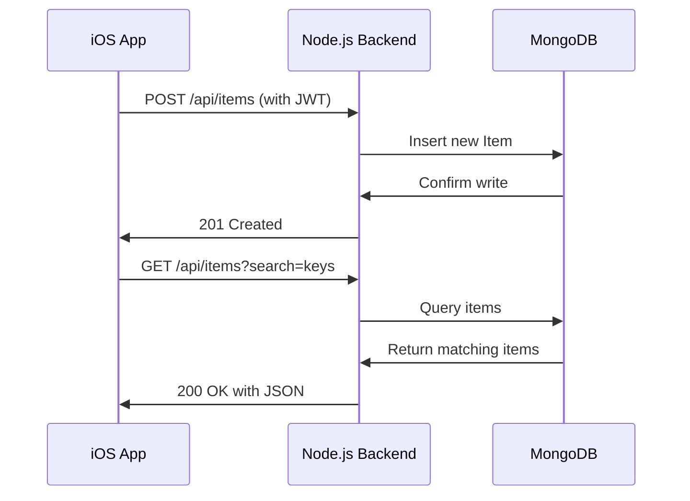

```markdown
# Pocket Butler Architecture

## Tech Stack
- **Frontend**: Swift + SwiftUI (iOS)
- **Backend**: Node.js + Express.js
- **Database**: MongoDB
- **Auth**: JWT Tokens
- **Notifications**: APNs (Apple Push Notification Service) + Geofencing

---

## Frontend (iOS) Structure
```
PocketButler/
├── Models/
│   ├── Item.swift          // Data model for tracked items
│   └── User.swift          // User auth/profile data
├── Views/
│   ├── HomeView.swift      // Main screen with search/favorites
│   ├── LogView.swift       // Item logging interface
│   ├── SettingsView.swift  // Account + premium features
│   └── SharedHouseholdView.swift // Family/Roommate collaboration
├── ViewModels/
│   ├── ItemViewModel.swift // Business logic for items
│   └── AuthViewModel.swift // Handles login/JWT tokens
├── Services/
│   ├── APIService.swift    // API calls to backend
│   └── NotificationService.swift // Handles smart alerts
├── Utilities/
│   ├── Extensions.swift    // SwiftUI helpers
│   └── Constants.swift     // API URLs, keys
└── Assets/
    └── Icons.xcassets      // App icons + UI images
```

### Key Frontend Components
1. **Voice/Widget Integration**:
   - Uses iOS Shortcuts for voice logging ("Hey Siri...")
   - Home Screen widget for one-tap logging
2. **State Management**:
   - `@StateObject` in SwiftUI for local UI state
   - `ItemViewModel` uses Combine to sync with backend
3. **Services**:
   - `APIService`: REST calls to Node.js backend with JWT headers
   - `NotificationService`: Triggers geofencing alerts via CoreLocation

---

## Backend (Node.js) Structure
```
src/
├── controllers/
│   ├── items.controller.js   // CRUD for items
│   ├── auth.controller.js    // Login/registration
│   ├── household.controller.js // Shared households
│   └── notifications.controller.js // Smart alerts
├── models/
│   ├── User.model.js         // MongoDB schema
│   ├── Item.model.js         // Item + location data
│   └── Household.model.js    // Shared user groups
├── routes/
│   └── api.js                // All Express routes
├── middleware/
│   ├── auth.js               // JWT verification
│   └── errorHandler.js       // Custom error responses
├── services/
│   ├── notification.service.js // Geofencing logic
│   └── apns.service.js       // Apple Push Notifications
├── config/
│   └── db.js                 // MongoDB connection
└── scripts/
    └── seed.js               // DB seeding (dev only)
```

### Key Backend Components
1. **JWT Auth Flow**:
   - User logs in → backend returns HTTP-only cookie with JWT
   - Middleware verifies JWT for protected routes
2. **Geofencing**:
   - Uses device GPS data to trigger "Did you forget X?" alerts
   - Integrates with Apple CoreLocation via webhooks
3. **Shared Households**:
   - MongoDB references between `User` and `Household` models
   - Real-time sync via Socket.IO (optional premium feature)

---

## Database Schema (MongoDB)
```javascript
// User
{
  email: String,
  password: String, // Hashed
  household: ObjectId, // Reference to Household
  premium: Boolean
}

// Item
{
  name: String,      // "keys", "wallet"
  location: String,  // "coffee table"
  owner: ObjectId,   // User reference
  timestamp: Date,
  photo: String?     // Base64 or S3 URL
}

// Household
{
  members: [ObjectId], // User IDs
  sharedItems: [ObjectId] // Item IDs
}
```

---

## Authentication Flow
1. User logs in → `/api/auth/login`
2. Backend validates credentials → issues JWT
3. JWT stored in HTTP-only cookie (secure)
4. Each API request includes `Authorization: Bearer <JWT>`
5. Token refresh via `/api/auth/refresh`

---

## State Management
- **Frontend**:
  - `ItemViewModel` keeps local cache of items
  - `@AppStorage` for user preferences (dark mode)
- **Backend**:
  - Stateless (JWT contains user ID)
  - Session blacklist (for logged-out tokens) in Redis (optional)

---

## Service Connections


---

## Bonus: Panic Mode
- Frontend plays local audio file (quack.mp3)
- Triggered by shaking phone or voice command
- Uses `AVFoundation` for sound playback
- Optional: Sync sound across household devices via WebSockets

---

## Deployment
- **Backend**: Docker container on Heroku/AWS
- **MongoDB**: Atlas cluster with daily backups
- **iOS**: TestFlight → App Store Connect
- **CDN**: Cloudflare for static assets

## Security
- Rate limiting on auth endpoints
- JWT expiration: 15 minutes access token, 7-day refresh token
- All API routes use HTTPS
``````markdown
---

## Error Handling & Logging
- **Frontend**:
  - Use `Combine` to handle API errors in SwiftUI (e.g., display toast messages).
  - Log critical events to Crashlytics/Firebase.
- **Backend**:
  - Centralized error handling via Express middleware (`errorHandler.js`).
  - Use `Winston` for structured logging (track API failures, auth issues).
  - Logs stored in MongoDB or forwarded to Elasticsearch (for premium scale).

---

## Testing Strategy
1. **Unit Tests**:
   - Swift: XCTest for ViewModels (e.g., `ItemViewModel` validation logic).
   - Node.js: Mocha/Chai for controllers (e.g., testing JWT middleware).
2. **Integration Tests**:
   - Postman/Newman: Validate end-to-end flows (e.g., log item → search item).
   - Test geofencing triggers using simulated GPS coordinates.
3. **UI Tests**:
   - Xcode UITests for voice/widget interactions.

---

## API Documentation
- **Swagger/OpenAPI**:
  - Auto-generated docs at `/api-docs` using `swagger-jsdoc`.
  - Example endpoint:
    ```yaml
    /api/items:
      post:
        summary: Log a new item
        security:
          - BearerAuth: []
        parameters:
          - name: item
            in: body
            schema:
              $ref: '#/definitions/Item'
    ```

---

## Third-Party Integrations
1. **Apple Push Notifications (APNs)**:
   - Send geofencing alerts via `apns.service.js`.
   - Token management for silent notifications.
2. **AWS S3** (Optional for Premium):
   - Store item photos in S3 buckets (vs. Base64 in MongoDB).
3. **Socket.IO**:
   - Real-time updates for shared households (e.g., "Dad moved keys").

---

## Scalability
- **Horizontal Scaling**:
  - Node.js backend deployed behind NGINX load balancer.
  - MongoDB sharding for high-volume item logs.
- **Caching**:
  - Redis cache frequent queries (e.g., user’s "favorite" items).
- **Queue System**:
  - Bull.js to handle notification bursts (e.g., 1000+ alerts at 8 AM).

---

## Data Privacy & Compliance
- **GDPR**:
  - User data deletion endpoint (`DELETE /api/user`).
  - Anonymize item logs after account deletion.
- **Encryption**:
  - Encrypt sensitive fields (e.g., `photo` URLs) using MongoDB Field-Level Encryption.
- **Audits**:
  - Log all auth attempts and password changes.

---

## CI/CD Pipeline
1. **GitHub Actions**:
   - Run SwiftLint/ESLint on pull requests.
   - Deploy Node.js to AWS Elastic Beanstalk on `main` merge.
2. **Fastlane**:
   - Automate iOS builds for TestFlight.
3. **Rollback Plan**:
   - Database migrations reversible via `mongoose` versioning.

---

## Monitoring & Analytics
- **Backend**:
  - Prometheus/Grafana dashboards for API latency, error rates.
- **Frontend**:
  - Track feature usage (e.g., "Panic Mode clicks") with Firebase Analytics.
- **Alerts**:
  - Slack notifications for 5xx errors or failed login spikes.

---

## Future Roadmap
1. **AI-Powered Predictions**:
   - Suggest item locations based on historical patterns ("Your keys are usually in the kitchen at 8 AM").
2. **Cross-Platform**:
   - Android version using Kotlin/Jetpack Compose.
3. **IoT Integration**:
   - Sync with smart home devices (e.g., "Ask Alexa where your wallet is").
4. **Offline Mode**:
   - CoreData/SQLite caching for item logs when offline.

---

## Backup & Disaster Recovery
- **MongoDB Atlas**:
  - Daily snapshots retained for 30 days.
  - Point-in-time recovery for accidental deletions.
- **S3 Backups**:
  - Weekly encrypted backups of user metadata.
- **Georedundancy**:
  - Backend deployed across AWS us-east and eu-west regions.

```

